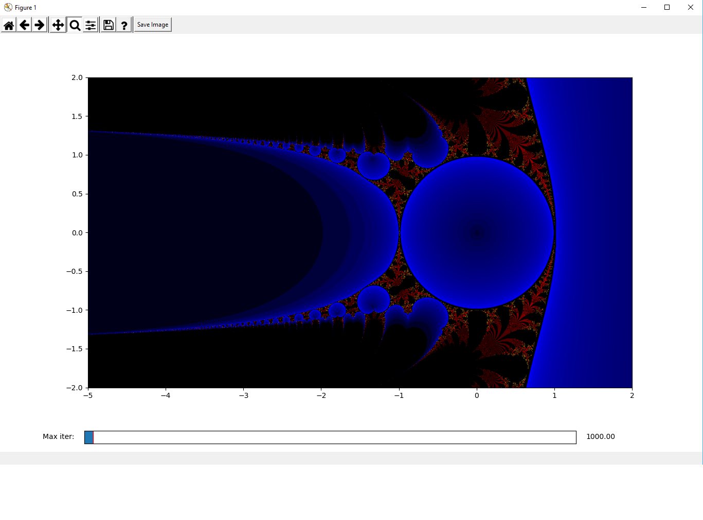
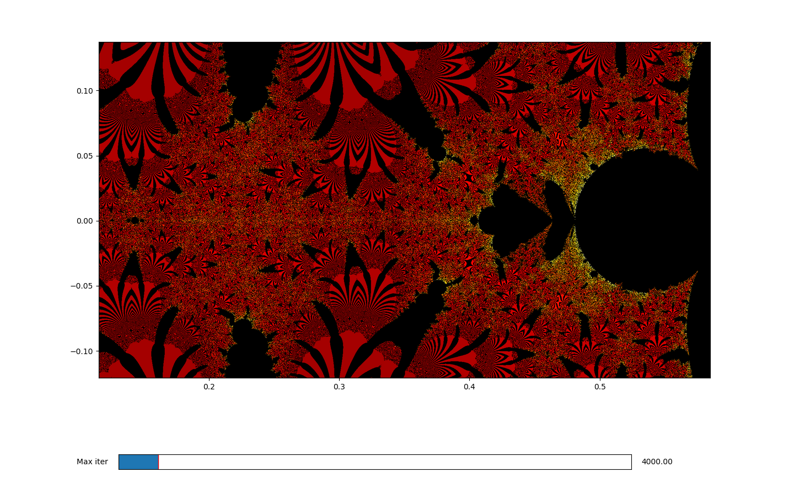
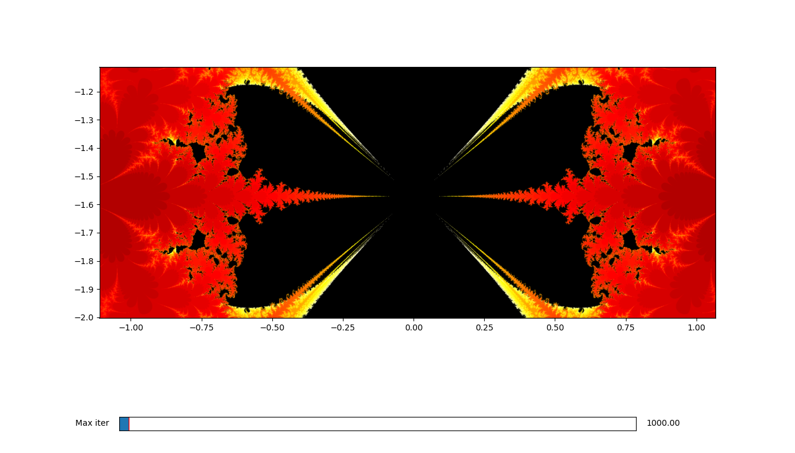
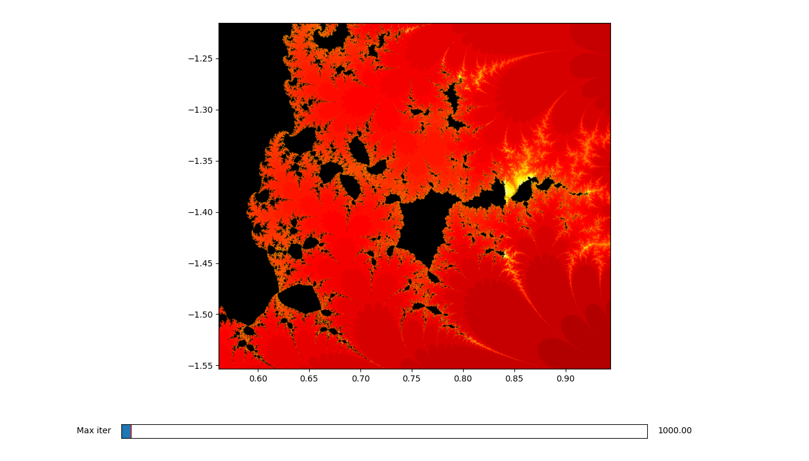
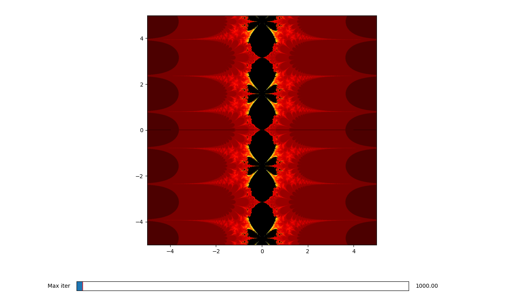

# Fractals with Python and CUDA

Fractals is a small project for exploring different kinds of fractals and colouring schemes with Python. It is powered 
by CUDA which is able to calculate most stuff fast enough for visualizing on-the-fly. For reference, rendering the 
standard 1500x1000-pixel Mandelbrot set with 1000 iterations takes about 0.08s on my computer with a GeForce GTX 970
which is pretty good for Python.

## Features

- Easily write your own CUDA kernels and device functions for different kinds of fractal maps and colouring schemes. 
  There will be plenty examples to copy from, so you only need the bare minimum knowledge of writing CUDA code
- For larger images and more intensive calculations you can also split the calculations over multiple kernel calls
- Explore fractals on a matplotlib imshow-canvas by zooming in/out, moving around and controlling maximum number of 
  iterations. Zooming and moving around will re-render the image with the new limits
- Save images of desired size or the whole matplotlib figure with the axes and all

 
 
 
 
 

## What you need

- CUDA drivers and compatible GPU
- Python Anaconda distribution with Numba, Numpy, Matplotlib and the cudatoolkit-package. I'm not sure if it can be made
  to work without Anaconda

## A short guide and few examples

For rendering and saving the image or starting up the exploration mode you only need to call

```python
create_image(kernel, 
             xmin, xmax, ymin, ymax,
             max_iter, 
             base_accuracy,
             path='fractal.png',
             show=True,
             splits=None,
             *args))
```
             
or 

```python
Explorer(kernel, 
         xmin, xmax, ymin, ymax,
         max_iter, 
         base_accuracy,
         splits=None,
         interpolation='None',
         *args))
```

The attributes are 

`kernel` = the CUDA kernel for calculating the fractal

`(xmin, xmax, ymin, ymax)` = range of the fractal

`max_iter` = maximum number of iterations

`base_accuracy` = the base size of the image (or number of pixels for whichever range (xmin, xmax) or (ymin, ymax) is the
smallest). For example for for the range x=(-1, 2) and y=(-1, 1) the size of the image in pixels will be 1500x1000

`show` = if set true, it will also pop-out the picture as soon as it is saved

`path` = path to save the image to

`interpolation` = one of the interpolation strategies from matplotlib (for example 'bilinear' and 'lanczos')

`splits` = the number of pieces the execution of the kernel will be split. More info about this a bit lower


#### The kernels and device functions

Lets take a look at a very basic simple kernel to calculate the Mandelbrot set

```python
@cuda.jit('void(int8[:,:,:], complex128, float64, float64, int32)')
def mandelbrot(image_array, topleft, xstride, ystride, max_iter):
    y, x = cuda.grid(2)

    if x < image_array.shape[1] and y < image_array.shape[0]:
        c = complex128(topleft + x * xstride - 1j * y * ystride)
        z = 0

        i = 0
        while i < max_iter and z.real * z.real + z.imag * z.imag < 4:
            z = z * z + c
            i += 1

        get_log_color_rgb(image_array, x, y, i, max_iter)
```

The arguments are something you probably don't need to get into very much, they are automatically supplied to the kernel
by using the functions above. The basic idea is that the normal Mandelbrot iteration `z = z*z + c` is done in parallel
for each pixel representing some complex-valued coordinate `x + yi`. The functions automatically calculate the 
coordinate for the topleft pixel of the screen and further pixels are seperated by the stride lengths. If you would
want to implement your own fractal map, you would need to just change the iteration logic inside the `while`-loop.

The function `get_log_color_rgb` is just a simple device function callable inside the kernels which "colours" a given 
pixel in position (x,y) according to some logic. Note the argument `device=True`

```python
@cuda.jit('void(int8[:,:,:], int32, int32, int32, int32)', device=True)
def get_log_color_rgb(image_array, x, y, iterations, max_iterations):
    if iterations == max_iterations:
        return

    k = 3.0 * real_log(float64(iterations)) / real_log(float64(max_iterations))

    if k < 1:
        image_array[y, x, 0] = int8(255 * k)
        image_array[y, x, 1] = 0
        image_array[y, x, 2] = 0
    elif k < 2:
        image_array[y, x, 0] = 255
        image_array[y, x, 1] = int8(255 * (k - 1))
        image_array[y, x, 2] = 0
    else:
        image_array[y, x, 0] = 255
        image_array[y, x, 1] = 255
        image_array[y, x, 2] = int8(255 * (k - 2))
```

Another useful device-function would be for example 

```python
@cuda.jit('complex128(complex128, float64)', device=True)
def power(c, x):
    return abs(c) ** x * exp(phase(c) * x * 1j)
```

For splitting the rendering into multiple smaller kernels you need to use a slightly different kind of kernels. Here
is for example a split kernel for mandelbrot

```python
@cuda.jit('void(int8[:,:,:], complex128, float64, float64, int32, int32, int32)')
def mandelbrot_split(image_array, topleft, xstride, ystride, max_iter, split_start, split_end):
    y, x = cuda.grid(2)
    y = y + split_start

    if x < image_array.shape[1] and y < split_end:
        c = complex128(topleft + x * xstride - 1j * y * ystride)
        z = 0

        i = 0
        while i < max_iter and z.real * z.real + z.imag * z.imag < 4:
            z = z * z + c
            i += 1

        get_log_color_rgb(image_array, x, y, i, max_iter)
```

The only differences are the `split_start` and `split_end` locations which need to be supplied. This is also
automatically calculated by the above functions if a number is given for the `splits`-argument. Depending on your
system, the kernel might interrupt if it takes too long to complete. For example, for windows the standard time limit
is by default 2s, which is quite short. This limit can be changed in the registry but you can also use these kind of 
split, smaller kernels. Overall, they take a bit more time because of the kernel-launch overhead (especially in python), 
but it avoids the system being possibly unresponsive.

More info on the timeout here: https://docs.nvidia.com/gameworks/content/developertools/desktop/timeout_detection_recovery.htm

Here's an example how to invoke the explorer with our mandelbrot kernel, 1000-pixel base accuracy, 1000 max 
iterations and bilinear interpolation for x=(-2, 1) and y(-1,1)

```python
from base import Explorer
from kernels import mandelbrot

if __name__ == "__main__":
    Explorer(mandelbrot, -2, 1, -1, 1, 1000, 1000, interpolation='bilinear').show()
```

Finally, let's look at a more complex example. Let's try to reproduce the power-tower fractal described in 
http://www.apmaths.uwo.ca/~rcorless/frames/PAPERS/LambertW/ with a very lazy way to detect cycles up to 3. The cycles
are coloured with simple blue.

```python
@cuda.jit('void(int8[:,:,:], complex128, float64, float64, int32)')
def lambert(image_array, topleft, xstride, ystride, max_iter):
    y, x = cuda.grid(2)

    if x < image_array.shape[1] and y < image_array.shape[0]:
        c = complex128(topleft + x * xstride - complex128(1j) * y * ystride)

        c = exp(c * exp(-c))
        z = c
        o = complex128(0.0)

        for i in range(max_iter):
            z = power(c, z)

            if isinf(z):
                get_log_color_rgb(image_array, x, y, i, max_iter)
                return

            if is_close(z, o):
                get_log_color_b(image_array, x, y, i, max_iter)
                return

            if i % 3 == 0:
                o = z
```

Note, that here we are now iterating until infinity by using the `cmath`-library function `isinf(z)`. 

```python
from base import Explorer
from kernels import lambert

if __name__ == "__main__":
    Explorer(lambert, -2, 1, -1, 1, 1000, 1000, interpolation='bilinear').show()
```

As a reference, this fractal with the given specs takes about ~2s to render on my computer, so it might be a good
idea to raise the CUDA kernel timeout limit or use a split version instead. Also, these kernels we looked at here
are not really optimized at all, but this is good enough for just simple exploration. For larger and more accurate
images, optimization of some kind is probably a good idea.

## Further reading

http://numba.pydata.org/numba-doc/0.13/CUDAJit.html

https://numba.pydata.org/numba-doc/latest/cuda/index.html

https://docs.nvidia.com/cuda/cuda-c-programming-guide/index.html
